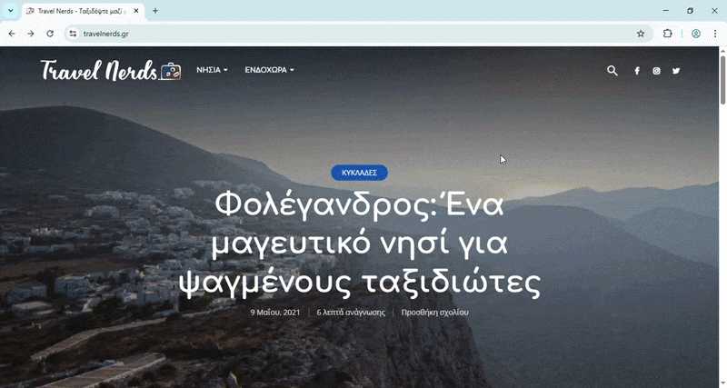
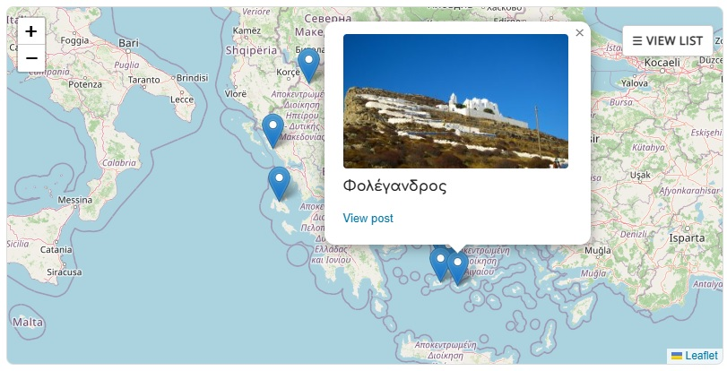
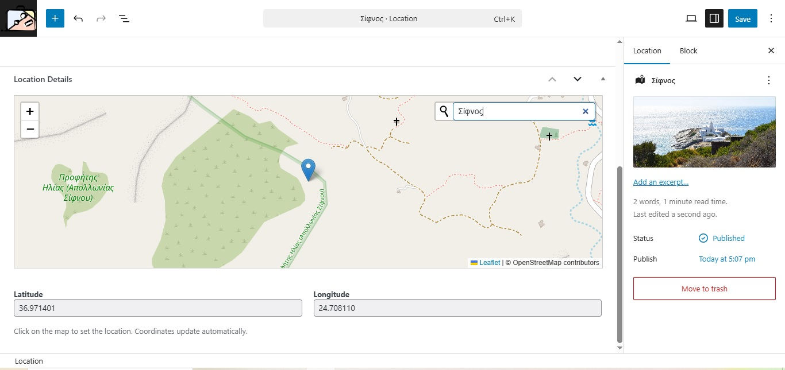

# Locator Pro (React Edition) 📍

A high-performance, modern WordPress plugin for managing and displaying multiple locations or points of interest. Built with **React 18**, **Leaflet**, and the **WordPress REST API**.



## 🌐 Live Demo
You can see the plugin in action on a real production site:
**[View Live Demo at TravelNerds.gr ↗](https://travelnerds.gr/)**


---

## 📸 Screenshots

### User Interface (Front-end)
*Interactive map with dynamic sidebar and custom popups.*


### Admin Management (Back-end)
*Easy location management with built-in OpenStreetMap Geocoding.*


## 🌟 Features

- **Dynamic React Sidebar:** An interactive, collapsible sidebar to browse locations easily.
- **Smart Map Logic:** Automatic "fit-to-bounds" zoom and smooth panning to selected markers.
- **Zero-Cost Geocoding:** Admin search box with autocomplete powered by OpenStreetMap (Nominatim) — no Google Maps API keys required.
- **Pro Popups:** Beautifully styled popups with featured image support and HTML content.
- **Modern Stack:** Uses Vite for fast builds and the WordPress REST API for data fetching.
- **Mobile Responsive:** Designed to work flawlessly on all screen sizes.

## 🚀 Installation

1. Clone the repository into your WordPress `wp-content/plugins/` directory:
   ```bash
   git clone [https://github.com/elenista/locator-pro.git](https://github.com/elenista/locator-pro.git)
   ```
2. Navigate to the plugin folder:

```
Bash
cd locator-pro
```

3. Install dependencies:

```
Bash
npm install
```

4. Build the project:

```
Bash
npm run build
```

5. Activate the plugin through the WordPress Admin dashboard.

## 🛠 Usage

1. **Add Locations:** Go to the "Locations" menu in your WordPress Admin and add your points of interest. Use the built-in map search to set the exact coordinates.

2. **Display Map:** Use the shortcode [lp_location_map] in any page or post to display the interactive map.

## 💻 Tech Stack

- **Frontend:** React.js, Leaflet, React-Leaflet.

- **Backend:** WordPress Custom Post Types, REST API, PHP.

- **Build Tool:** Vite with vite-plugin-singlefile for seamless WordPress integration.

## 📝 License

This project is licensed under the GPL-2.0 License.

---

Developed with ❤️ by Eleni Stavridou
